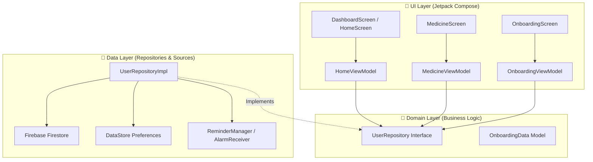
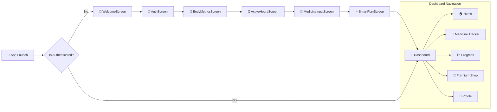

<div align="center">

# 🔔 Health Bell (v1.2)
### Smart Health & Medication Management Android Application

[](https://github.com)
[](https://developer.android.com)
[](https://kotlinlang.org)
[](https://developer.android.com/jetpack/compose)
[](https://firebase.google.com)
[](https://dagger.dev/hilt/)

---

> ⚠️ **CONFIDENTIAL & PROPRIETARY PROPERTY**  
> This source code, architectural design, and associated assets are **strictly private** and owned exclusively by the Client. Unauthorized copying, distribution, decompilation, or sharing with third-party developers is **strictly prohibited**.

</div>

---

## 📌 Project Overview

**Health Bell** is a modern, enterprise-grade Android application designed to empower users in managing their daily health, medication schedules, body metrics, and wellness goals. Built using modern Android development practices, **Clean Architecture**, **Jetpack Compose (Material 3)**, and **Firebase Cloud Infrastructure**.

---

## 🚀 Key Features

| Feature | Description | Component / Tech |
| :--- | :--- | :--- |
| 🔔 **Smart Medicine Reminders** | Exact-alarm reminders with overlay popups & notification actions (Take/Snooze) | `AlarmManager`, `NotificationHelper`, `ReminderActivity` |
| 📊 **Body Metrics & Progress** | Tracks weight, BMI, activity hours, and daily progress logs | `ProgressScreen`, `BodyMetricsScreen`, `Firestore` |
| 💊 **Medication Planner** | Intake scheduling, dosage frequency, and smart plan generation | `MedicineInputScreen`, `SmartPlanScreen`, `DataStore` |
| 🔐 **Secure Authentication** | Email/Password login & Google One-Tap Sign-In | `Firebase Auth`, `Play Services Auth` |
| 🛒 **In-App Subscriptions** | Premium health plans and feature unlocks via Play Store Billing | `BillingManager`, `Play Billing SDK 9.1` |
| 📲 **Push Notifications** | Real-time FCM notifications and automated background reminders | `HealthBellMessagingService`, `WorkManager` |

---

## 🏗️ Architecture & Data Flow

The project strictly follows **Clean Architecture** combined with the **MVVM (Model-View-ViewModel)** design pattern for clear separation of concerns, testability, and scalability.



---

## 🧭 Navigation & User Journey



---

## 📂 Directory Structure

```
HealthBell2/
├── app/
│   ├── src/main/java/com/ideacraftlab/healthbell/
│   │   ├── core/                  # Core modules & Dependency Injection
│   │   │   └── di/                # Hilt Modules (FirebaseModule, RepositoryModule)
│   │   ├── data/                  # Data layer implementations
│   │   │   ├── manager/           # BillingManager, NotificationHelper, ReminderManager
│   │   │   ├── receiver/          # AlarmReceiver, ReminderActionReceiver
│   │   │   ├── repository/        # UserRepositoryImpl
│   │   │   └── service/           # HealthBellMessagingService (FCM)
│   │   ├── domain/                # Business logic & Domain interfaces
│   │   │   ├── model/             # OnboardingData & Domain entities
│   │   │   └── repository/        # UserRepository interface
│   │   └── ui/                    # UI layer (Jetpack Compose)
│   │       ├── dashboard/         # HomeScreen, MedicineScreen, ProgressScreen, ShopScreen
│   │       ├── onboarding/        # WelcomeScreen, AuthScreen, SmartPlanScreen, etc.
│   │       ├── reminder/          # ReminderActivity (Full-screen alarm overlay)
│   │       └── theme/             # Material 3 Color Palette, Typography, Shapes
│   ├── build.gradle.kts           # App-level build config (R8, dependencies)
│   └── google-services.json       # Firebase credentials (GIT-IGNORED)
├── gradle/                        # Gradle wrapper & Version Catalog
│   └── libs.versions.toml         # Centralized dependency versions
├── build.gradle.kts               # Root build script
├── settings.gradle.kts            # Subproject settings
└── .gitignore                     # Protection rules for sensitive files
```

---

## 🔒 Source Code Protection & Client Security

To ensure that **unauthorized developers or third parties cannot access, extract, or clone** this project, the following multi-layer security measures are strictly enforced:

```
🛡️ SECURITY LAYERS
├── 1. VCS Security          --> Private Repository & Git-Ignored Credentials
├── 2. Code Obfuscation     --> R8 / ProGuard Minification (Release Build)
├── 3. Credentials Safety    --> Environment Injected Keys & Hidden Keystore
└── 4. Legal / IP Protection --> Proprietary License & Confidentiality Terms
```

### 1. Private Repository Enforcement
- The Git repository **MUST** remain set to **PRIVATE**.
- Sensitive files (`google-services.json`, `*.jks`, `local.properties`, build outputs) are strictly listed in `.gitignore` to prevent accidental commit.

### 2. Code Obfuscation & Reverse Engineering Protection (R8 / ProGuard)
Release builds are compiled with **R8 code shrinking and bytecode obfuscation**:
```kotlin
buildTypes {
    release {
        isMinifyEnabled = true
        isShrinkResources = true
        proguardFiles(
            getDefaultProguardFile("proguard-android-optimize.txt"),
            "proguard-rules.pro"
        )
    }
}
```
*Effect:* Any attempt to decompile the released APK/AAB produces completely obfuscated and unreadable code (`a.b.c`), hiding proprietary business logic and endpoints.

### 3. Keystore & API Secrets Isolation
- The signing key (`.jks`) and Firebase config (`google-services.json`) are maintained outside the shared code repository.
- Developers without explicit permission will not be able to build release binaries or spoof server authentication.

---

## 🛠️ Tech Stack & Dependencies

| Category | Technology | Version |
| :--- | :--- | :--- |
| **Language** | Kotlin | `2.0.21` |
| **Minimum / Target SDK** | Android SDK | Min: `24` / Target: `37` |
| **UI Framework** | Jetpack Compose (Material 3) | BOM `2026.08.00` |
| **Adaptive Layouts** | Compose Adaptive | `1.0.0` |
| **Architecture / DI** | Hilt | `2.60.1` |
| **Navigation** | Navigation Compose | `2.8.5` |
| **Backend & Cloud** | Firebase Auth / Firestore / FCM | BOM `33.10.0` |
| **Monetization** | Google Play Billing | `9.1.0` |
| **Local Storage** | DataStore Preferences | `1.1.1` |
| **Background Tasks** | WorkManager | `2.10.0` |

---

## ⚙️ Building & Running the Project

### Prerequisites
1. **Android Studio** (Ladybug / Iguana or newer with JDK 17)
2. **Android SDK 37** installed
3. **`google-services.json`** provided by the Client placed inside `app/`

### Build Commands

```bash
# Clean project
./gradlew clean

# Build Debug APK
./gradlew assembleDebug

# Build Production Release Bundle (AAB)
./gradlew bundleRelease
```

---

## 📄 License & Confidentiality Notice

```
===============================================================================
                       CLIENT PROPRIETARY NOTICE
===============================================================================
Copyright (c) 2026 Idea Craft Lab / Client. All Rights Reserved.

This software contains valuable trade secrets and proprietary information 
belonging to the Client. Any disclosure, copying, distribution, or creation of 
derivative works by unauthorized developers or third parties is strictly prohibited.
===============================================================================
```

<div align="center">
  <sub>Developed for Client by <b>Idea Craft Lab</b> • All Rights Reserved</sub>
</div>
